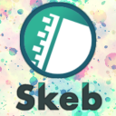

## Profile
 おれんじじゅーすを飲むきゅーけつきです！ฅ(＾・ω・＾ฅ)   
 #VR  #STYLY  #TRPG

         

## Items
          

## Notes
[モデルのアウトラインのみを描写するシェーダー](blogs/page01.html)  

[0から始めるQuestビルド](blogs/page02.html)  

[波長ベース色空間【光の波長をRGBに変換】](blogs/page03.html)  

[【Unity】GoogleDriveからVRMファイルをインポートする](blogs/page04.html)  

[【Unity】Humanoidモデルの手の形を制御する](https://qiita.com/HhotateA/items/e4d240fbf9a95683b706)  

[自分の部屋をデジタル空間に持っていった話](blogs/page06.html)  

[オブジェクト形状に合ったフィルターをシェーダーで実装する](blogs/page07.html)  

[CameraDepthTextureからワイヤーフレームを計算する](blogs/page08.html)  

## 自己紹介
　主にVRChatを中心にVRの創作活動をしています。 最近はARやMRも含めたxR全般のデバイスを触っています。
　個人的なVR技術の目標は、MRゴーグルのようなデバイスを万人がつけている状態で現実を物理基底世界とVRの2レイヤーにし、アバターと生身の人間が共存し、朝起きて同じイベントに行く人たちが「今日はVRで出かけよう」「今日は外の空気を吸おう」っていうことを自由に選択できる世界が理想です。
　目標に近づくために現在は"デジタルデータを物理空間に持ってくる"or"物理空間をデジタルデータ化"すること(デプスセンサーや3Dプリント)を実験しています。 ただしアバター文化が好きなので、自分はアバターで生活したいです。実際今後リアル志向からアバター志向の時代になると思っています。

　現在お仕事として、STYLYというAR,VRプラットフォームを作っています。
　STYLYはPCVRやスマートフォンに対応したプラットフォームで、ブラウザからも閲覧が可能です。
　誰もが自分の作ったシーンを公開したり体験することが可能で、アートやMVの世界に入り込む経験が出来ます。
　左は、フォトグラメトリ技術を使って作成した自室の3Dモデル空間です。
　STYLY上にアップロードしており、実態にデジタル上で歩き回ることができます。 

## Links
- Booth : [HOTATE’S VIRTUALAB](https://hhotatea.booth.pm/)
- Discord : [ほたての貝殻](https://discord.gg/G6fMeAEutg)
- 開発中の物 : [GitHub](https://github.com/HhotateA)
- Twitter : [@HhotateA_xR](https://twitter.com/HhotateA_xR)
- FaceBook : [ほたて ねこまじん](https://www.facebook.com/HhotateA)
- 求職 : [Wantedly](https://www.wantedly.com/users/104624003)
- 技術記事 : [Qiita](https://qiita.com/HhotateA)
- TRPGサイト：[ほたてねこまじんのキャラ一覧](https://charas.hhotatea.com/)
- ポートフォリオ：[ほたてのポートフォリオ](https://work.hhotatea.com/)