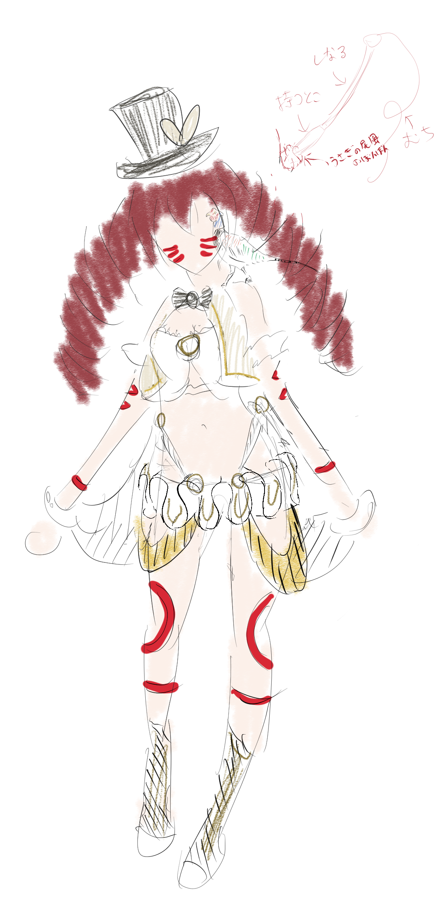
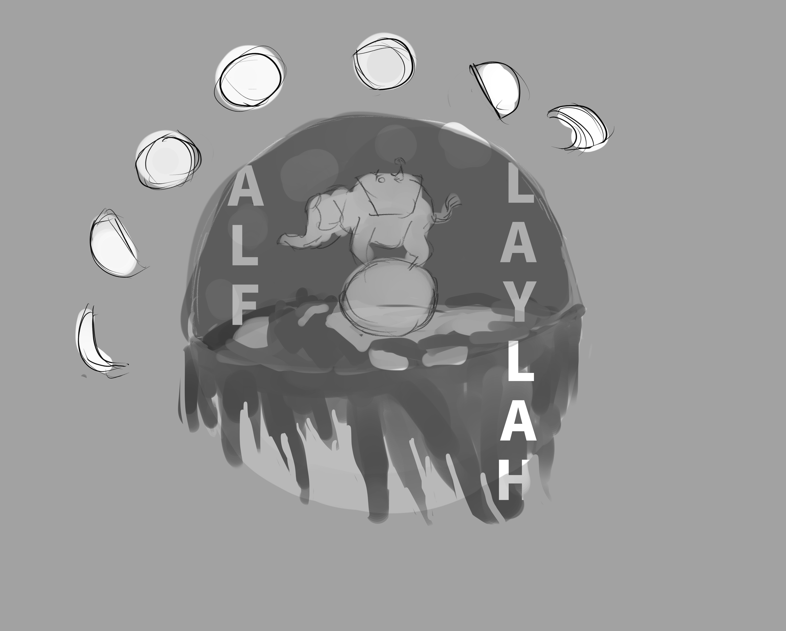

## アルフ・レイラ・サーカス キャラデザイン

### イメージ
- 色 ： チューリップの赤系
- 職業 ： サーカスの猛獣使い。動物は友達というか襲われる、非捕食者（兎）って感じ。
- 性格 ： おとなしめ（片言外国人みたいな、おどおどしたイメージ）
- 服装 ： ベリーダンス衣装の上にサーカス衣装。基本的に布は白地に金ラインみたいなイメージ

#### 髪型
- ツインドリル
- 赤髪
#### 顔
- 金色の瞳
- 猫の髭っぽい入れ墨
#### 身体
- 胸がでかい
- おへそは見えている
- 腕や脚に赤い入れ墨
#### 服装（胴体）
- 胸のインナーはベリーダンスの衣装みたいな感じ
- ボレロ / ベスト（デザインは、[トルコ民族衣装風なボレロ　ピンク](https://www.oryantalsaray.com/?pid=31004867 ) みたいな感じ）
- 左右の手首から背中に布が繋がっている（ベリーダンス衣装イメージ）
- 肩にペットの鳥が止っている（雉イメージ）
#### 服装（頭）
- 小さめなトップハット
- ハットに兎耳っぽい赤リボン
- 帽子にはサーカスの[ロゴ](#logo)が印刷されている
#### 服装（腰下）
- ひだ襟っぽいスカート
- 踵と爪先が開いたタイプの足袋？ソックス？（入れ墨と色を合わせる）
#### アクセサリー
- 鞭を手に持っている
- チューリップをあしらったブレスレット

## アルフ・レイラ・サーカス ロゴデザイン

- 象が玉乗りしている（猛獣使い・曲芸師要素）
- 月がジャグリングのボールのように空を飛んでいる（道化師要素）
- 全体がサーカステントになっている。
- 象の上の絨毯でシェヘラザードがお話を語りかけている。
- 地球平面説っぽい半球＋ガラスドームに全体が包まれている
- ドームの中にサーカス名「ALF LAYLAH」の文字