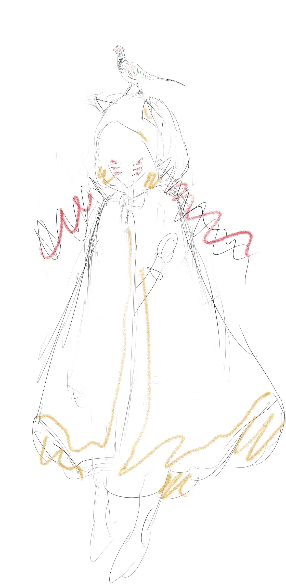

## アルフ・レイラ・サーカス キャラデザイン

### 基本情報
- 名前 ： ラーレ
- イメージカラー ： チューリップの赤系
- 職業 ： サーカスの猛獣使い。動物は友達というか襲われる、非捕食者って感じ。
- 好物 ： 桃・ハチミツ（キャラ名の由来は桃のラテン語読み）
- 性格 ： おとなしめ（片言外国人みたいな、おどおどしたイメージ）
- 人種 ： イギリス人＋日本人ハーフ（赤毛のイギリス白人っぽいイメージ）
- 服装 ： ベリーダンス衣装の上にサーカス衣装。

#### 髪型
- ツインドリル
- 赤髪（良い刺し色があったらツートーンもあり）
#### 顔
- 金色の瞳
- 猫の髭っぽい入れ墨
#### 身体
- 胸がおっきめ
- おへそは見えている
- 腕や脚に幾何学模様的な赤い入れ墨
#### 服装（胴体）
- 胸のインナーは[ベリーダンス](https://www.pixiv.net/artworks/101250893)の衣装みたいな感じ
- ボレロ / ベスト（デザインは、[トルコ民族衣装風なボレロ](https://www.oryantalsaray.com/?pid=31004867 ) みたいな感じ）
- 左右の手首から背中に布が繋がっている（ベリーダンス衣装イメージ）
- 肩にペットの鳥が止っている（雉イメージ）
#### 服装（頭）
- 小さめなトップハット
- ハットに兎耳っぽい赤リボン
- 帽子にはサーカスの[ロゴ](#logo)が印刷されている
#### 服装（腰下）
- ひだ襟っぽいスカート（色は悩み中） 
- 踵と爪先が開いたタイプの足袋？ソックス？（黒か赤）
#### アクセサリー
- 黒い鞭を手に持っている
- 鞭は兎の尻尾みたいなぼんぼんが付いている。紐の方はめっちゃ長くてしなる
- チューリップをあしらった髪飾りで髪を結んでいる（ここは大事にしたい要素）
#### ポーズ
- 演舞中、鞭を左右の手で持っているポーズ（伝えるの難しいので、いくつか資料貼っておきます。）
- https://www.pixiv.net/artworks/33935248
- https://www.pixiv.net/artworks/41532808
- https://www.pixiv.net/artworks/64035603
- https://www.pixiv.net/artworks/13497677

### 衣装差分

- お忍び用、マントを被っている差分
- 猫耳のフード
- 布は白地に金ラインみたいなイメージ

### 表情差分
- 通常差分：ちょっと考え事してるっぽい無表情系の顔
- クリティカル差分：演舞中の顔（汗＋ウィンク笑顔）
- ファンブル差分：恥ずかしがってる顔（涙ぐんで頬を赤らめている）
- 可能だったら＋αおまかせ表情

## アルフ・レイラ・サーカス ロゴデザイン

- 象が玉乗りしている（猛獣使い・曲芸師要素）
- 月がジャグリングのボールのように空を飛んでいる（道化師要素）
- 全体がサーカステントになっている。
- 象の上の絨毯でシェヘラザードがお話を語りかけている。
- 地球平面説っぽい半球＋ガラスドームに全体が包まれている
- ドームの中にサーカス名「ALF LAYLAH」の文字

## キャラクターシート
キャラクターシート、いちおう貼っておきます。  
メモ欄には「不辜のサァカス　ナイフノモツレ」のネタバレが含まれます。  
[ラーレ（仮称）](https://iachara.com/view/8212403) 