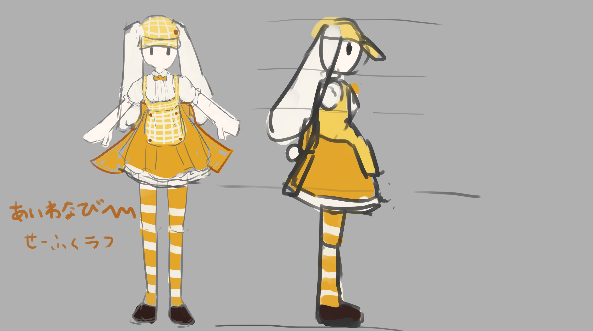

## ミーシェ・ザッハトルテ

### 基本情報
- 名前 ： ピスターシュ・ディアボガッタ（Pistache=diavogatta）
- イメージカラー ： ガトーピスターシュ
- 職業 ： パティシエ
- 好物 ： チョコレート
- 性格 ： ハイテンションおばあちゃん。
- 人種 ： やんごとない感じのお嬢さまっぽい感じ。
- 服装 ： カフェの制服

#### 全体的なイメージ
- 全体的にケーキみたいなイメージ
- 制服や髪にもトッピング（お菓子のアクセサリー）を付けている
#### 髪型
- クリーム色の髪
- 料理人なので、髪はある程度纏めてる。三つ編みとか？おまかせ。
#### 顔
- 緑色の瞳
#### 服装
- カフェの制服（白いブラウス＋黄色いエプロン）
- [これみたいなデザイン](./cafe_seihuku.png)
- リボンは資料より赤濃い目の色（オーナーだから）
#### 服装（頭）
- キャスケット帽にロップイヤーが縫い付けられてる
- 腕にカチューシャ
#### 服装（腰下）
- 黄色いスカートをバニエで膨らませている
- 縞々ソックス、ひざ下くらいまでの長さ
#### アクセサリー
- フルーツの髪飾り
- お菓子のアクセサリーをエプロンとかに付けてる
- 左手に泡だて器、右手にボウルみたいなお菓子作りスタイル
- 可能だったら水鉄砲持ってる差分
- さらに可能だったら札束を持っている差分

### 表情差分
- 通常表情、どや顔気味
- 笑顔、屈託のない感じ
- よだれ、キラキラ目
- むすーと怒ってる
- 転びそうで慌てた顔
- サングラス（8bitみたいなやつ）可能だったら
- 口笛(;´･ω･)